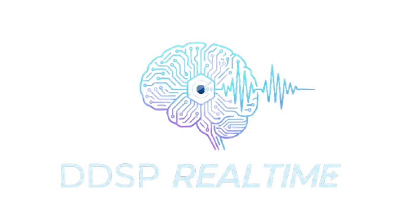

<p align="center">
  
</p>

# DDSP Realtime

**Lightweight, real-time DDSP (Differentiable Digital Signal Processing) synthesis library for on-device neural audio generation.**

DDSP Realtime is a from-scratch C++ implementation of Google's DDSP neural audio synthesis, optimized for real-time performance on mobile and desktop platforms. Unlike the original JUCE-based VST implementation, this library provides a clean, framework-agnostic core that can be integrated into any audio application.

## Features

- **🚀 Real-time Performance**: Optimized for low-latency audio synthesis (<20ms)
- **📱 Cross-platform**: macOS, iOS, visionOS, Linux support
- **🎹 MIDI Control**: Full MIDI input processing with pitch and velocity control
- **🧠 Neural Synthesis**: TensorFlow Lite-based harmonic + noise synthesis
- **⚡ Hardware Acceleration**: CoreML delegate support on Apple platforms
- **🔌 Flexible Integration**: Clean C++ API, no framework dependencies in core
- **🎼 Multi-voice**: Support for polyphonic synthesis (tested with 3-voice chords)

## Architecture

```
ddsp-realtime/
├── core/                    # ⭐ Core DDSP library (framework-agnostic)
│   ├── include/ddsp/        # Public API headers
│   └── src/                 # Implementation
│
├── examples/                # Usage examples
│   ├── unity-plugin/        # Unity Native Audio Plugin
│   ├── python-server/       # WebSocket server with Python bindings
│   └── vst-plugin/          # VST3/AU plugin (future)
│
├── third_party/             # External dependencies
│   ├── tflite/              # TensorFlow Lite
│   ├── juce/                # JUCE (audio utilities only)
│   └── unity_sdk/           # Unity Audio Plugin SDK
│
├── models/                  # Pre-trained TFLite models
└── docs/                    # Documentation
```

### Core Components

The `ddsp_core` library provides:

- **`InferencePipeline`**: Main synthesis pipeline with background rendering
- **`PredictControlsModel`**: TFLite model inference for control parameters
- **`HarmonicSynthesizer`**: Additive synthesis with harmonic control
- **`NoiseSynthesizer`**: Filtered noise synthesis
- **`MidiInputProcessor`**: MIDI note processing and pitch conversion

## Quick Start

### Prerequisites

- **CMake** 3.20 or later
- **C++17** compatible compiler (Clang, GCC, MSVC)
- **TensorFlow Lite** libraries (download script provided)
- **Python 3.8+** (optional, for Python bindings)

### Build from Source

```bash
# 1. Clone repository
git clone https://github.com/woosukj/ddsp-realtime.git
cd ddsp-realtime

# 2. Initialize submodules (JUCE)
git submodule update --init --recursive

# 3. Setup dependencies
./scripts/setup_deps.sh

# 4. Build everything
mkdir build && cd build
cmake .. -DCMAKE_BUILD_TYPE=Release
make -j$(nproc)

# 5. Install (optional)
sudo make install
```

### Build Options

```bash
# Build only the core library
cmake .. -DBUILD_CORE_ONLY=ON

# Build specific examples
cmake .. -DBUILD_UNITY_PLUGIN=OFF -DBUILD_PYTHON_BINDINGS=ON

# Enable CoreML acceleration (Apple platforms)
cmake .. -DUSE_COREML_DELEGATE=ON
```

## Usage Examples

### Unity Plugin

Build and integrate the Unity Native Audio Plugin:

```bash
cd examples/unity-plugin
./build.sh

# Output: build/AudioPluginDDSP.bundle (macOS)
#         build/AudioPluginDDSP.framework (iOS/visionOS)
```

Copy the built plugin to your Unity project:
```
YourUnityProject/Assets/Plugins/iOS/AudioPluginDDSP.bundle
```

Usage in Unity:
```csharp
// Attach DDSPController to a GameObject
var ddsp = GetComponent<DDSPController>();
ddsp.SetF0(440.0f);        // Set frequency (Hz)
ddsp.SetLoudness(0.8f);    // Set amplitude (0-1)
ddsp.SetPitchShift(2.0f);  // Shift up 2 semitones
```

### Python Server

Build and run the WebSocket server for real-time synthesis:

```bash
cd examples/python-server

# Install Python dependencies
pip install -r requirements.txt

# Build Python bindings
./build.sh

# Run server
python3 server.py
```

Control via JSON WebSocket messages:
```json
{
  "f0s": [440, 550, 660],  // Frequencies for 3-voice chord (Hz)
  "loudness": 0.7          // Overall loudness (0-1)
}
```

### C++ API

Direct usage of the core library:

```cpp
#include <ddsp/InferencePipeline.h>

// Initialize pipeline
ddsp::InferencePipeline pipeline;
pipeline.prepareToPlay(48000.0, 512);
pipeline.loadModel("models/Violin.tflite");

// Set control parameters
pipeline.setF0Hz(440.0);           // Fundamental frequency
pipeline.setLoudnessNorm(0.8);     // Loudness (normalized)
pipeline.setPitchShift(0.0);       // Pitch shift (semitones)

// Start background rendering
pipeline.startTimer(20);  // 20ms update interval

// Get audio output
float buffer[512];
int samples = pipeline.getNextBlock(buffer, 512);
```

## Models

Pre-trained models are included in `models/`:

- **Violin.tflite** (7.5 MB) - Violin synthesis
- *(More instruments coming soon)*

Models are trained using Google's DDSP library and converted to TensorFlow Lite format.

### Using Custom Models

Set the model path via environment variable:
```bash
export DDSP_MODEL_PATH=/path/to/your/model.tflite
```

Or pass directly in code:
```cpp
pipeline.loadModel("/path/to/model.tflite");
```

## Performance

Tested on Apple M1 Mac:
- **Latency**: <2ms (with 512 sample buffer @ 48kHz)
- **CPU Usage**: ~5% (single voice)
- **Memory**: ~20MB (including model)

With CoreML delegate:
- **Inference Time**: **<0.5ms per frame**
- **CPU Usage**: ~2% (offloaded to Neural Engine)

## Dependencies

### Core Library
- **TensorFlow Lite** (2.x) - Neural network inference
- **JUCE** (7.x) - Audio utilities only (FFT, resampling)
  - `juce_core`, `juce_audio_basics`, `juce_dsp`

### Examples
- **Unity SDK** - Native Audio Plugin API (Unity plugin only)
- **pybind11** (2.11+) - C++ to Python bindings (Python server only)
- **websockets** - Python WebSocket library (Python server only)

## Project History

This project evolved from [DDSP-VST](https://github.com/magenta/ddsp-vst), a JUCE-based VST plugin. We extracted and rewrote the core DDSP synthesis pipeline to:

1. **Remove JUCE framework dependency** - Use JUCE only for audio utilities (FFT, etc.), not as a framework
2. **Support Unity integration** - Enable on-device synthesis in Unity games/apps
3. **Add Python bindings** - Allow server-side synthesis via WebSocket API
4. **Optimize for mobile** - Target iOS/visionOS with CoreML acceleration

The result is `ddsp_core`: a clean, reusable library that can be integrated anywhere.

## Documentation

- [Build Guide](docs/BUILD.md) - Detailed build instructions
- [API Reference](docs/API.md) - Core library API documentation
- [Architecture](docs/ARCHITECTURE.md) - System design and data flow
- [Examples Guide](docs/EXAMPLES.md) - Using the example applications

## Contributing

Contributions are welcome! Please see [CONTRIBUTING.md](CONTRIBUTING.md) for guidelines.

## License

This project is licensed under the Apache License 2.0. See [LICENSE](LICENSE) for details.

## Acknowledgments

- **Google Magenta** - Original DDSP research and implementation
- **DDSP-VST** - Original VST plugin implementation
- **TensorFlow Lite** - Efficient on-device inference
- **JUCE** - Audio utilities and DSP

## Citation

If you use this library in your research, please cite:

```bibtex
@software{ddsp_realtime,
  title = {DDSP Realtime: Lightweight Neural Audio Synthesis},
  author = {Woosuk Ji},
  year = {2025},
  url = {https://github.com/woosukj/ddsp-realtime}
}
```

Original DDSP paper:
```bibtex
@inproceedings{engel2020ddsp,
  title={DDSP: Differentiable Digital Signal Processing},
  author={Engel, Jesse and Hantrakul, Lamtharn and Gu, Chenjie and Roberts, Adam},
  booktitle={International Conference on Learning Representations},
  year={2020}
}
```

## Contact

- **Issues**: [GitHub Issues](https://github.com/woosukj/ddsp-realtime/issues)
- **Discussions**: [GitHub Discussions](https://github.com/woosukj/ddsp-realtime/discussions)

---

**Built with ❤️ for real-time neural audio synthesis**
